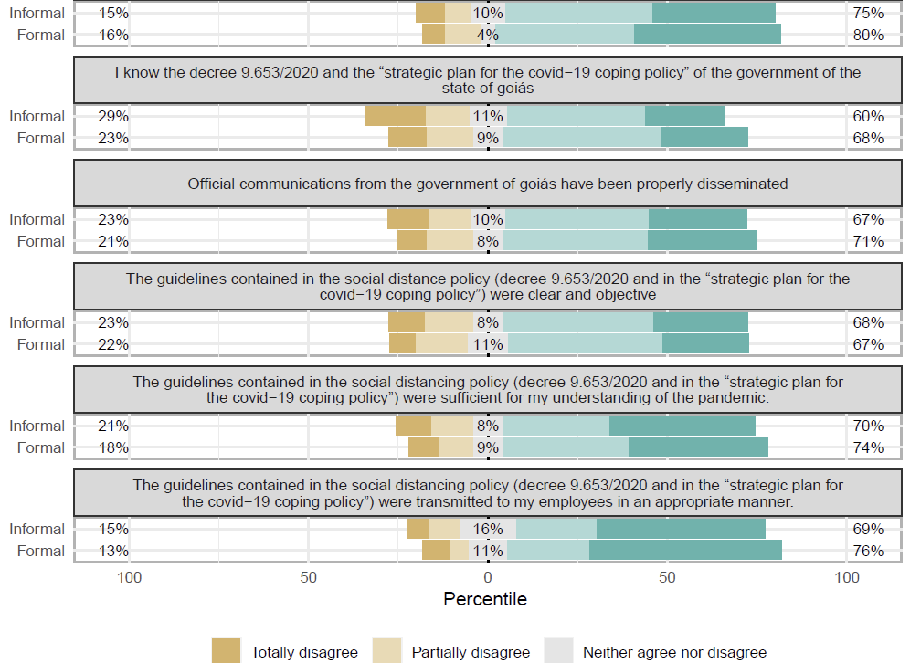
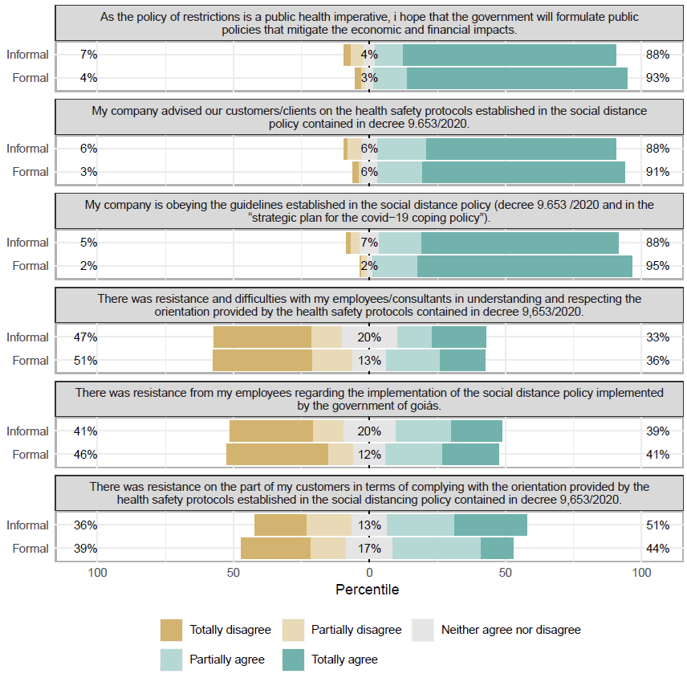
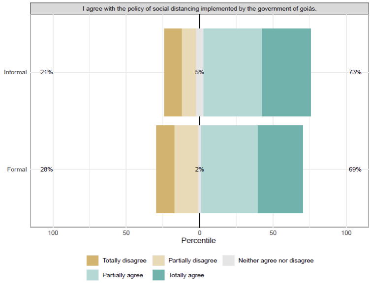

# Data-Driven Analysis of Social Distancing Policy Implementation in Goiás, Brazil

At the beginning of the COVID-19 pandemic, I led a study focused on understanding how newly introduced public health regulations — specifically social distancing mandates — were being received and implemented by businesses in the State of Goiás, Brazil. The objective was to generate high-quality, empirical data that could be reported directly to the **Governor’s Office** to inform real-time policy adjustments. The analysis would help guide decisions about whether to maintain, modify, or expand mitigation measures, based on the actual capacity of businesses to implement the protocols and the public's response to them.

The focus wasn’t about gauging public support in the political sense, but rather on whether people *understood the measures*, saw them as *operationally feasible*, and were *able to implement them consistently* within their business context.

To approach this question, I designed a structured survey grounded in implementation science and policy evaluation literature. We focused on three core dimensions:

- **Communication effectiveness**
- **Compliance**
- **Perceived legitimacy**

The instrument was deployed to 459 businesses — a mix of formal (registered) and informal (unregistered) operators. All statistical processing was done using **R**, where I managed data cleaning, categorical response modeling, Likert-scale visualization, and chi-square testing.

---

## Applying Technical Tools to Evaluate Policy Uptake

This project involved:

- Survey item design using neutral language
- Data pipeline in R: `dplyr`, `psych`, `likert`
- Visualization and group comparison via chi-square tests
- Quasi-experimental interpretation of cross-group response behavior

---

## What the Data Told Us

- Informal businesses saw **more customer resistance**
- Formal businesses faced **more employee difficulties**
- Clear communication increased perceived legitimacy

**Figure 1 – Communication**  
*This figure shows six survey items related to communication effectiveness and how responses were distributed by business type.*  

**Figure 2 – Compliance**  
*Includes significant variation in perceived resistance from customers vs. staff, depending on business type.*  

**Figure 3 – Legitimacy**  
*Visual representation of agreement with the purpose of the distancing policy by business type.*  

These results were formally reported to the State Secretariat of Health and the Governor’s Office, where they contributed to decision-making around the continuation and adaptation of distancing protocols in subsequent phases of the response.

---

## Reflections

This project applied healthcare analytics and policy science in a time-sensitive context. It showed how even in non-experimental settings, clear methods and structured instruments can uncover important behavioral insights that shape effective public health strategy.

---
# analysis.R
# COVID-19 Policy Implementation in Goiás: Survey Analysis
# -----------------------------------------------
# NOTE:
# This script uses a simulated dataset to illustrate the analysis
# workflow. It has been adapted from the original study to preserve
# data confidentiality and research ethics.
#
# The logic, variables, and structure reflect the real analysis conducted
# for reporting to the Government of Goiás, but the data itself is not real.

## Tags

`healthcare data analytics`, `R programming`, `policy compliance`, `COVID-19`, `survey methods`, `public health`, `behavioral analysis`
